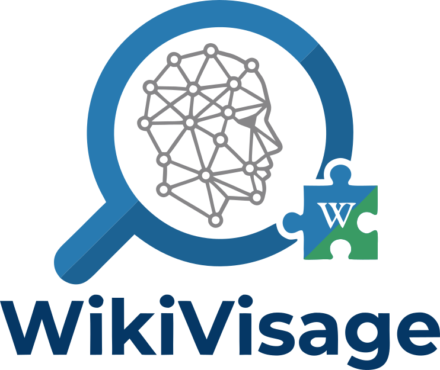
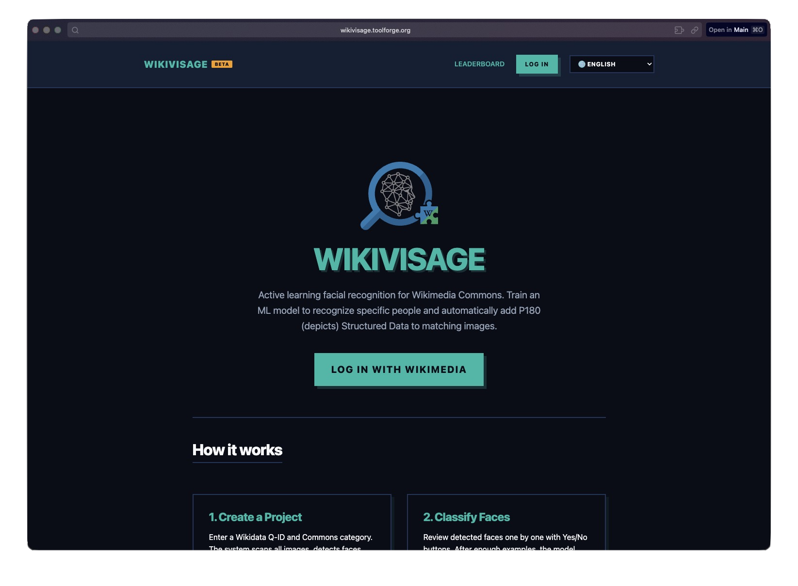

<p align="center">
        
</p>

<p align="center">
        
        
        <a href="https://github.com/DiFronzo/WikiVisage/actions/workflows/ci.yml">
                
        </a>
        <a href="https://github.com/DiFronzo/WikiVisage/releases">
                
        </a>
        
        
        <a href="LICENSE">
                
        </a>
</p>

Active-learning face tagging for Wikimedia Commons: train a lightweight model with simple **Yes/No** feedback and (optionally) write [P180 (depicts)](https://www.wikidata.org/wiki/Property:P180) Structured Data claims to matching files via OAuth.



## 🔗 Quick links

- 📖 Local dev guide: [test-local.md](test-local.md)
- 🚀 Toolforge deploy guide: [how-to-run-it.md](how-to-run-it.md)
- 🤝 Contributing: [CONTRIBUTING.md](CONTRIBUTING.md)

## ✨ Highlights

- 🧠 **Active learning UI**: fast yes/no classification with keyboard shortcuts
- 🧵 **Background worker**: crawls Commons categories, downloads images, detects faces (HOG), and stores encodings
- 🧷 **Bootstrap from existing tags**: seeds the model via SPARQL when depicts already exists
- 🤖 **Autonomous inference**: centroid-distance classification once you have enough confirmed examples
- ✍️ **User-triggered Commons edits**: click “Send Edits to Wikimedia Commons” to write depicts claims via the Wikibase API
- 🌍 **i18n-ready**: translations included (en, nb, es, fr)

## 🧭 How it works

1. 🆕 **Create a project** — pick a Wikidata entity (e.g., `Q42`) and a Commons category
2. 🔎 **Discover images** — the worker traverses the category and detects faces
3. 🧷 **Bootstrap (optional)** — if Commons already has depicts claims, seed the model from them
4. ✅❌ **Classify** — review faces one-by-one with Yes/No (keyboard shortcuts: `Y` / `N`)
5. 🤖 **Infer** — after enough confirmed faces (default `5`), classify remaining faces automatically
6. ✍️ **Write to Commons** — send approved matches as depicts claims (OAuth)

## 🏗️ Architecture

```
+---------------------------+      +---------------------------+
|       Flask Web App       |      |     Background Worker     |
|          (app.py)         |      |       (worker.py)         |
|---------------------------|      |---------------------------|
| OAuth 2.0 login           |      | Category traversal        |
| Project CRUD              |      | Image download            |
| Active learning UI        |      | HOG face detection        |
| Classification UI         |      | SPARQL bootstrapping      |
| Queue SDC writes          |      | Autonomous inference      |
|                           |      | Write SDC claims          |
+------------+--------------+      +------------+--------------+
             |                                  |
             +----------------------------------+
                               |
                        +------------+
                        |   MariaDB  |
                        |  (ToolsDB) |
                        +------------+
```

- 🧰 **Stack**: Python 3.11+, Flask, gunicorn, face_recognition (dlib HOG), PyMySQL, requests-oauthlib
- ☁️ **Hosted on**: [Wikimedia Toolforge](https://wikitech.wikimedia.org/wiki/Help:Toolforge) (Kubernetes Build Service)

## 🗂️ Project layout

```
WikiVisage/
├── app.py               # Flask app: OAuth, routes, classification API
├── worker.py            # Background ML pipeline: crawl, detect, infer, write
├── database.py          # MariaDB connection pool with retry logic
├── schema.sql           # Database schema (tables + indices)
├── migrate.py           # Idempotent migration script
├── templates/           # Jinja2 templates
├── static/              # Logos + screenshots
├── translations/        # i18n: en, nb, es, fr
├── requirements.txt     # Runtime dependencies
├── requirements-dev.txt # Dev/test deps
└── whitelist.txt        # Allowed usernames (Toolforge)
```

## 🧑‍💻 Setup

### ✅ Prerequisites

- A [Toolforge](https://toolsadmin.wikimedia.org/) tool account
- An [OAuth 2.0 consumer](https://meta.wikimedia.org/wiki/Special:OAuthConsumerRegistration/propose) registered on Meta with grants:
        - `Basic rights`
        - `Edit existing pages`
        - Callback URL: `https://<toolname>.toolforge.org/auth/callback`

### 1) 🔐 Environment variables (Toolforge)

```bash
# Database credentials (find yours in ~/replica.my.cnf on Toolforge)
toolforge envvars create TOOL_TOOLSDB_USER      "s<NNNNN>"
toolforge envvars create TOOL_TOOLSDB_PASSWORD  "<password>"
toolforge envvars create WIKIVISAGE_DB_NAME     "s<NNNNN>__wikiface"

# OAuth 2.0
toolforge envvars create OAUTH_CLIENT_ID        "<client-id>"
toolforge envvars create OAUTH_CLIENT_SECRET    "<client-secret>"
toolforge envvars create OAUTH_REDIRECT_URI     "https://<toolname>.toolforge.org/auth/callback"

# Flask
toolforge envvars create FLASK_SECRET_KEY "$(python3 -c 'import secrets; print(secrets.token_hex(32))')"
```

### 2) 🗄️ Create database

```bash
mariadb --defaults-file=$HOME/replica.my.cnf -h tools.db.svc.wikimedia.cloud
```

```sql
CREATE DATABASE s<NNNNN>__wikiface;
```

### 3) 🧱 Run migration

```bash
python3 migrate.py
```

### 4) 🚀 Build & deploy

```bash
# Build container image
toolforge build start https://github.com/DiFronzo/WikiVisage.git

# Start web service
toolforge webservice buildservice start

# Start background worker (uses jobs.yaml)
toolforge jobs load jobs.yaml
```

The app will be live at `https://<toolname>.toolforge.org`.

## 🧪 Local development

```bash
pip install -r requirements.txt

export TOOL_TOOLSDB_USER=root
export TOOL_TOOLSDB_PASSWORD=yourpassword
export TOOL_TOOLSDB_HOST=127.0.0.1
export WIKIVISAGE_DB_NAME=wikiface_dev
export OAUTH_CLIENT_ID=<client-id>
export OAUTH_CLIENT_SECRET=<client-secret>
export OAUTH_REDIRECT_URI=http://localhost:8000/auth/callback
export FLASK_SECRET_KEY=dev-secret-key
export OAUTHLIB_INSECURE_TRANSPORT=1

mysql -u root -p -e "CREATE DATABASE wikiface_dev"
python migrate.py
python app.py        # Web app on http://localhost:8000
python worker.py     # Background worker (separate terminal)
```

For local OAuth you’ll need a separate consumer with `http://localhost:8000/auth/callback` as the callback URL. Set `OAUTHLIB_INSECURE_TRANSPORT=1` to allow OAuth over HTTP.

## ⚙️ Configuration

Each project has a couple of tunables:

| Parameter | Default | Description |
|---|---:|---|
| `distance_threshold` | `0.6` | Face-distance cutoff for autonomous classification (lower = stricter). |
| `min_confirmed` | `5` | Minimum confirmed matches before autonomous inference starts. |

## ✅ Testing

```bash
# Unit tests (CI mode)
pytest tests/ -v

# Unit + integration tests (requires local MariaDB)
WIKIVISAGE_TEST_DB=1 pytest tests/ -v
```

## 📝 License

[MIT](LICENSE)
